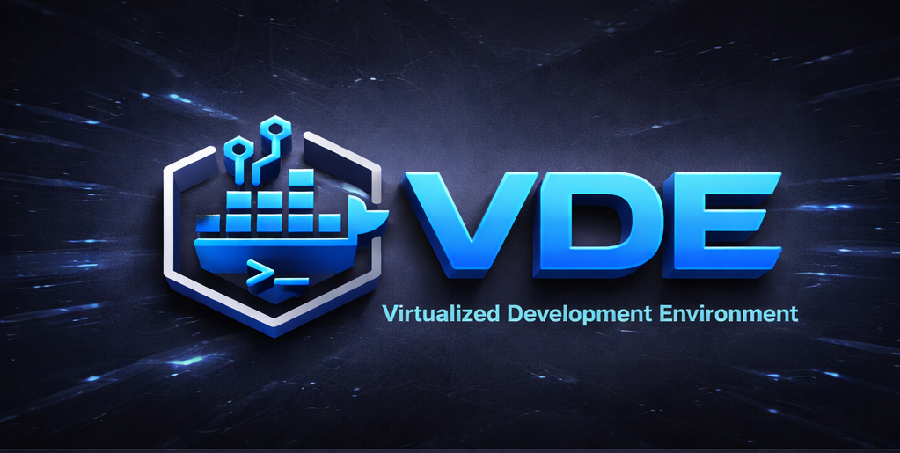

# README
<!-- @armor (Student Documentation) -->
<p align="center"></p>

# The Way of the VDE: 1.5.2 (The Sovereign Baseline)


A sovereign, template-based ecosystem of Dockerized Spokes. Forged for the warrior who demands absolute isolation, consistent hydration, and governed development. 1.5.2 is the **Sovereign Baseline**, certified through the Proof of Life contract.

**🛡️ The Sovereign Record:** The default branch for this Forge is `develop` (**The Anvil**). Stable, certified releases reside on `main` (**Production**).

---

## This is the Way. 👋

Welcome, Foundling, to the VDE. You are entering a dual-project ecosystem:

1. **Project 1: The Armor (`@armor`)**: The student-facing development engine. It is AI-blind and Hub-blind, providing the physical Spokes (containers) where you work as the `devuser`.
2. **Project 2: The Forge (`@forge`)**: The universal development AI-governance system. It enforces the Rule Spine, manages the GitHub lifecycle, and audits your path through agentic intelligence.

---

## The Unyielding Tetrad (The System Spine) 🏗️

The Forge does not ignite without the four pillars. Every mission begins with a Spine Check:

| Pillar | Requirement | Purpose |
| :--- | :--- | :--- |
| **I. Zsh** | Version 5.0+ | The Voice of the Tribe. **ZSH ONLY.** |
| **II. Git** | Version 2.30+ | The Chronicler of your Strike. |
| **III. Docker** | Desktop / Engine | The World-Forge for your Spokes. |
| **IV. SSH** | `vde_student` key | The Transversal Bridge connecting the Hub to the Spokes. |

---

## The Path of the Foundling (Quick Start) 🚀

If you are new to the Creed, execute the onboarding ritual:

```zsh
# 1. Clone the Baseline
git clone https://github.com/dderyldowney/vde-system.git ~/vde
cd ~/vde

# 2. Take the Path of the Foundling
bin/vde path-of-the-foundling
```

---

## Core Mandates (The Resol’nare) 🛡️

- **Mandate L (Proof of Life)**: The lifecycle (`init`, `create`, `rebuild`, `start`, `enter`, `stop`, `remove`, `add`, `uninstall`) is the project's **Heartbeat**. Failure in any state is a Protocol Blockade.
- **Identity Purity**: You operate as `devuser` inside all Spokes. Access is secured via the `vde_student` SSH identity key.
- **Workspace Persistence**: Save your code in `$HOME/workspace/` inside the Spoke to ensure it is persistently synced to your Hub.
- **Mandate C (Zsh Only)**: All rituals, scripts, and shells are Zsh-native.
- **Mandate 24 (Architectural Tagging)**: Every file is marked as `@armor`, `@forge`, or `@shared-law`.

---

## The Archivist's Intel 📇

| Section | Description |
|---------|-------------|
| **📘 Warrior's Guide** | [USER_GUIDE.md](USER_GUIDE.md) - Complete walkthrough for students. |
| **🛠️ Installation** | [VDE_INSTALL.md](VDE_INSTALL.md) - Prerequisite setup and Induction. |
| **📜 Protocol** | [VDE_PROTOCOL.md](VDE_PROTOCOL.md) - The Laws of the Forge and Branching. |
| **🤝 Contributing** | [CONTRIBUTING.md](CONTRIBUTING.md) - How to join the Tribe's effort. |
| **📐 Architecture** | [Architecture 1.5.2](docs/ARCHITECTURE.md) - The Blueprint. |

---

## Reinforcements (The Tracking Fob) 🆘

If the Forge stalls, consult the Sentinel:

```zsh
vde health        # Audit the Hub's health (Spine Check)
vde info <alias>  # Inspect a specific Spoke's state
vde nuke          # The Great Quench (Reset everything)
```

**This is the Way.**
