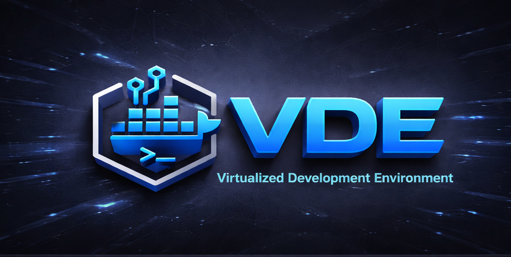

<p align="center"></p>

** Every workflow has been tested and verified to work. Follow the steps, they will work for you too. **

---

## Table of Contents

1. [1. Installation](#1.-installation)
2. [2. SSH Keys](#2.-ssh-keys)
3. [3. Your First VM](#3.-your-first-vm)
4. [4. Understanding](#4.-understanding)
5. [5. Starting and Stopping](#5.-starting-and-stopping)
6. [6. Your First Cluster](#6.-your-first-cluster)
7. [7. Connecting](#7.-connecting)
8. [8. Working with Databases](#8.-working-with-databases)
9. [9. Daily Workflow](#9.-daily-workflow)
10. [10. Adding More Languages](#10.-adding-more-languages)
11. [11. Troubleshooting](#11.-troubleshooting)

---

## 1. Installation

This is the part everyone finds confusing. Let's break it down.

### What You Need Before Starting

**What you need:**
- [ ] Docker Desktop installed and running
- [ ] Git installed (for cloning the repo)
- [ ] About 5GB of free disk space

### Step 1: Clone VDE to Your Computer

**Scenario: Getting the VDE code**

```
Given I want to install VDE
When I clone the VDE repository to ~/dev
Then VDE files should be in place
```

**Open your terminal and run:**
```bash
# Clone the repository
git clone <repo-url> ~/dev

# Go into the directory
cd ~/dev
```

### Step 2: Run the Initial Setup

**Scenario: First-time setup creates everything**

```
Given I have cloned VDE to ~/dev
And I'm running the setup for the first time
When I run the initial setup script
Then VDE should be properly installed
And required directories should be created
```

**Run the setup:**
```bash
./scripts/build-and-start
```

**What this does:**
- Creates all necessary directories (configs, projects, data, logs, etc.)
- Sets up proper file permissions
- Initializes the VDE framework

### Step 3: Verify Installation

**Scenario: Checking that VDE is ready**

```
Given I've just installed VDE
When I run "list-vms"
Then I should see all predefined VM types
And python, rust, js, csharp, ruby should be listed
And postgres, redis, mongodb, nginx should be listed
```

**Verify everything is ready:**
```bash
./scripts/list-vms
```

**Expected output:** You should see a list of available language and service VMs.
---

## 2. SSH Keys

This is automatic, but you should understand what's happening.

### Automatic SSH Key Generation

**Scenario: SSH keys are created if you don't have them**

```
Given I'm setting up VDE for the first time
And no SSH keys exist on my system
When SSH keys are checked
Then ed25519 keys should be generated automatically
And public keys should be copied to VMs
```

**What happens:**
1. VDE checks if you have SSH keys (~/.ssh/id_ed25519)
2. If not, it creates them for you automatically
3. Public keys are copied to the `public-ssh-keys/` directory
4. VMs are configured to use these keys for access

### Your SSH Config is Updated Automatically

**Scenario: SSH config is set up for you**

```
Given SSH config file does not exist
When I create my first VM
Then SSH config should be created
And SSH config entry for the VM should be added
And I can connect using simple names like "python-dev"
```

**You don't need to:**
- Manually create SSH keys
- Edit your SSH config file
- Copy keys to VMs
- Set up SSH agent forwarding

**VDE does all of this for you.**
---

## 3. Your First VM

Let's create your first development environment. We'll start with Python because it's the most common language for beginners.

### Creating Your Python VM

**Scenario: Creating a Python development environment**

```
Given I've just installed VDE
And I want my first development environment
When I run "create-virtual-for python"
Then a Python development environment should be created
And configs/docker/python/ should be created
And docker-compose.yml should be generated
And SSH config entry for "python-dev" should be added
And projects/python directory should be created
```

**Run this command:**
```bash
./scripts/create-virtual-for python
```

**What you'll see:**
- Progress messages as Docker builds the image
- "SSH config entry created" message
- "Your Python VM is ready" message

### Starting Your First VM

**Scenario: Starting the Python VM**

```
Given I created a Python VM
When I run "start-virtual python"
Then the Python VM should be started
And I should be able to SSH to "python-dev"
```

**Run this command:**
```bash
./scripts/start-virtual python
```

**What happens:**
- Docker container starts
- SSH port 2200 is allocated
- Your projects/python directory is mounted
- You're ready to code!
---

## 4. Understanding

Let's verify everything works and understand the pieces.

### Check That Your VM is Running

**Scenario: Verifying VM status**

```
Given I started my Python VM
When I run "list-vms"
Then I should see which VMs are running
And Python should show as "running"
```

**Check status:**
```bash
./scripts/list-vms
```

**You should see:**
- python: **running** (on port 2200)

### Understanding Your Directory Structure

**Scenario: Your workspace is set up correctly**

```
Given I created a Python VM
When I look at my directories
Then projects/python/ should exist for my code
And the directory should be mounted in the VM
```

**Your directory structure:**
```
~/dev/
├── configs/          # VM configurations
├── projects/         # YOUR CODE GOES HERE
│   └── python/       # Python projects (mounted in VM)
├── data/            # Database data (persists across rebuilds)
├── logs/            # Application logs
└── scripts/         # VDE management commands
```
---

## 5. Starting and Stopping

Daily workflow: starting when you work, stopping when done.

### Starting Your VM

**Scenario: Starting a stopped VM**

```
Given I created a Python VM earlier
And it's currently stopped
When I run "start-virtual python"
Then the Python VM should start
And I can connect to it
```

**Command:**
```bash
./scripts/start-virtual python
```

### Stopping Your VM

**Scenario: Stopping a running VM**

```
Given I have a Python VM running
When I run "shutdown-virtual python"
Then the Python VM should be stopped
And the configuration should remain for next time
```

**Command:**
```bash
./scripts/shutdown-virtual python
```

**Important:** Stopping doesn't delete your VM - it just stops the container. Your code and configurations are safe.
---

## 6. Your First Cluster

Now let's build a real application stack. This is where VDE shines.

### Understanding What We're Building

You'll have:
- **Python VM** - Your application code (port 2200)
- **PostgreSQL VM** - Your database (port 2400)
- **Redis VM** - Your cache (port 2401)

All three can talk to each other automatically.

### Creating Your Service VMs

**Scenario: Creating database and cache VMs**

```
Given I have VDE installed
And I need a database and cache
When I run "create-virtual-for postgres"
And I run "create-virtual-for redis"
Then PostgreSQL VM configuration should be created
And Redis VM configuration should be created
```

**Create both services:**
```bash
./scripts/create-virtual-for postgres
./scripts/create-virtual-for redis
```

### Starting Your Full Stack

**Scenario: Starting all three VMs together**

```
Given I created VMs for python, postgres, and redis
When I run "start-virtual python postgres redis"
Then all three VMs should be running
And Python VM can connect to PostgreSQL
And Python VM can connect to Redis
```

**Start your full stack:**
```bash
./scripts/start-virtual python postgres redis
```

### Verifying Your Cluster is Running

**Scenario: Checking all VMs are communicating**

```
Given I started python, postgres, and redis
When I check VM status
Then I should see all three running
And they should be on the same Docker network
```

**Check status:**
```bash
./scripts/list-vms
```

**Expected output:**
```
VM          Type        Status    Port
----------------------------------------
python      language    running   2200
postgres    service     running   2400
redis       service     running   2401
```
---

## 7. Connecting

### Connecting to Your Python VM

**Scenario: SSH into your development environment**

```
Given I have a Python VM running
When I run "ssh python-dev"
Then I should be connected to the Python VM
And I should be in the projects/python directory
```

**Connect:**
```bash
ssh python-dev
```

**You're now inside your VM!** You can:
- Run Python code
- Install packages
- Edit files in projects/python/
- Access postgres and redis

### Exiting a VM

**To exit:** Just type `exit` or press `Ctrl+D`

### Connection Reference

| VM Name | SSH Command | What It's For |
|---------|-------------|---------------|
| c-dev | `ssh c-dev` | C development |
| cpp-dev | `ssh cpp-dev` | C++ development |
| asm-dev | `ssh asm-dev` | Assembler development |
| python-dev | `ssh python-dev` | Python development |
| rust-dev | `ssh rust-dev` | Rust development |
| js-dev | `ssh js-dev` | JavaScript/Node.js |
| csharp-dev | `ssh csharp-dev` | C# development |
| ruby-dev | `ssh ruby-dev` | Ruby development |
| go-dev | `ssh go-dev` | Go development |
| java-dev | `ssh java-dev` | Java development |
| kotlin-dev | `ssh kotlin-dev` | Kotlin development |
| swift-dev | `ssh swift-dev` | Swift development |
| php-dev | `ssh php-dev` | PHP development |
| scala-dev | `ssh scala-dev` | Scala development |
| r-dev | `ssh r-dev` | R development |
| lua-dev | `ssh lua-dev` | Lua development |
| flutter-dev | `ssh flutter-dev` | Flutter development |
| elixir-dev | `ssh elixir-dev` | Elixir development |
| haskell-dev | `ssh haskell-dev` | Haskell development |
| postgres | `ssh postgres` | Direct database access |
| redis | `ssh redis` | Direct Redis access |
| mongodb | `ssh mongodb` | Direct MongoDB access |
| nginx | `ssh nginx` | Direct Nginx access |
| couchdb | `ssh couchdb` | Direct CouchDB access |
| mysql | `ssh mysql` | Direct MySQL access |
| rabbitmq | `ssh rabbitmq` | Direct RabbitMQ access |
---

## 8. Working with Databases

### Connecting to PostgreSQL from Your Python VM

**Scenario: Connecting from Python to PostgreSQL**

```
Given I have Python and PostgreSQL running
When I SSH into python-dev
And I run "psql -h postgres -U devuser"
Then I should be connected to PostgreSQL
And I can run database queries
```

**Try it yourself:**
```bash
# 1. Connect to your Python VM
ssh python-dev

# 2. Connect to PostgreSQL from within the VM
psql -h postgres -U devuser

# 3. You're now in PostgreSQL! Try:
# \list                    # List databases
# \c devuser               # Connect to default database
# \dt                      # List tables
# SELECT 1;                # Run a query
# \q                       # Quit
```

### Your Database Data Persists

**Scenario: Database data survives rebuilds**

```
Given I created tables in PostgreSQL
When I rebuild the PostgreSQL VM
And I reconnect to PostgreSQL
Then my tables should still exist
```

**Important:** Database data in `~/dev/data/postgres/` persists even when you rebuild VMs. Your data is safe.
---

## 9. Daily Workflow

### Morning Routine: Start Your Development Environment

**Scenario: Starting all your VMs at once**

```
Given I created VMs for my project
When I run "start-virtual python postgres redis"
Then all VMs should be running
And I can start working immediately
```

**One command to start your day:**
```bash
./scripts/start-virtual python postgres redis
```

### During the Day: Check What's Running

**Scenario: Checking VM status**

```
Given I've been working for a while
When I want to know what's running
Then I should see all running VMs
And their status should be clear
```

**Check status:**
```bash
./scripts/list-vms
```

### End of Day: Stop Everything

**Scenario: Clean shutdown**

```
Given multiple VMs are running
When I run "shutdown-virtual all"
Then all VMs should stop gracefully
And my work is saved
```

**Stop everything:**
```bash
./scripts/shutdown-virtual all
```
---

## 10. Adding More Languages

### Creating a Second Language VM

**Scenario: Adding Rust to your environment**

```
Given I have Python running
And I want to work with Rust
When I run "create-virtual-for rust"
And I run "start-virtual rust"
Then Rust VM should be running
And I can use both Python and Rust
```

**Add Rust:**
```bash
./scripts/create-virtual-for rust
./scripts/start-virtual rust
```

### Starting Multiple Language VMs

**Scenario: Working with multiple languages**

```
Given I created VMs for Python, Rust, and JavaScript
When I run "start-virtual python rust js"
Then all three language VMs should be running
And I can switch between them
```

**Start multiple at once:**
```bash
./scripts/start-virtual python rust js
```
---

## 11. Troubleshooting

### Problem: A VM Won't Start

**Scenario: Diagnosing startup failures**

```
Given I tried to start a VM but it failed
When I check the error
Then I should see a clear error message
And I should know if it's:
- A port conflict
- A Docker issue
- A configuration problem
```

**What to check:**
1. Is Docker running? `docker ps`
2. Is the port already in use? `./scripts/list-vms`
3. Check the logs: `docker logs <vm-name>`

### Problem: Changes Aren't Reflected

**Scenario: Rebuilding after configuration changes**

```
Given I modified the Dockerfile to add a package
And the VM is already running
When I run "start-virtual python --rebuild"
Then the VM should be rebuilt
And the new package should be available
```

**Rebuild with --rebuild:**
```bash
./scripts/start-virtual python --rebuild
```

**For complete rebuild (no cache):**
```bash
./scripts/start-virtual python --rebuild --no-cache
```
---

## Quick Reference Card

### Essential Commands

```bash
# See what VMs are available
./scripts/list-vms

# Create a new VM
./scripts/create-virtual-for <name>

# Start VMs
./scripts/start-virtual <vm1> <vm2> ...

# Stop VMs
./scripts/shutdown-virtual <vm1> <vm2> ...

# Stop everything
./scripts/shutdown-virtual all

# Rebuild a VM
./scripts/start-virtual <vm> --rebuild
```

### SSH Connections

```bash
# Language VMs
ssh c-dev           # C development
ssh cpp-dev         # C++ development
ssh asm-dev         # Assembler development
ssh python-dev      # Python development
ssh rust-dev        # Rust development
ssh js-dev          # JavaScript/Node.js
ssh csharp-dev      # C# development
ssh ruby-dev        # Ruby development
ssh go-dev          # Go development
ssh java-dev        # Java development
ssh kotlin-dev      # Kotlin development
ssh swift-dev       # Swift development
ssh php-dev         # PHP development
ssh scala-dev       # Scala development
ssh r-dev           # R development
ssh lua-dev         # Lua development
ssh flutter-dev     # Flutter development
ssh elixir-dev      # Elixir development
ssh haskell-dev     # Haskell development

# Service VMs
ssh postgres        # PostgreSQL database
ssh redis           # Redis cache
ssh mongodb         # MongoDB
ssh nginx           # Nginx web server
ssh couchdb         # CouchDB
ssh mysql           # MySQL
ssh rabbitmq        # RabbitMQ
```

### Default Ports

| VM | Port |
|----|------|
| c-dev | 2200 |
| cpp-dev | 2201 |
| asm-dev | 2202 |
| python-dev | 2203 |
| rust-dev | 2204 |
| js-dev | 2205 |
| csharp-dev | 2206 |
| ruby-dev | 2207 |
| go-dev | 2208 |
| java-dev | 2209 |
| kotlin-dev | 2210 |
| swift-dev | 2211 |
| php-dev | 2212 |
| scala-dev | 2213 |
| r-dev | 2214 |
| lua-dev | 2215 |
| flutter-dev | 2216 |
| elixir-dev | 2217 |
| haskell-dev | 2218 |
| postgres | 2400 |
| redis | 2401 |
| mongodb | 2402 |
| nginx | 2403 |
| couchdb | 2404 |
| mysql | 2405 |
| rabbitmq | 2406 |

---

## Available VM Types

### Language VMs (19 total, for writing code)

| Language | Command | Aliases | Best For |
|----------|---------|---------|---------|
| C | `create-virtual-for c` | c | Systems programming |
| C++ | `create-virtual-for cpp` | c++, gcc | Systems, performance |
| Assembler | `create-virtual-for asm` | assembler, nasm | Low-level programming |
| Python | `create-virtual-for python` | python3, py | Web backends, AI/ML, scripts |
| Rust | `create-virtual-for rust` | rust-dev | Systems, performance |
| JavaScript | `create-virtual-for js` | node, nodejs | Web frontends, Node.js |
| C# | `create-virtual-for csharp` | dotnet, csharp | .NET development |
| Ruby | `create-virtual-for ruby` | rb, ruby | Rails, scripts |
| Go | `create-virtual-for go` | golang | Services, microservices |
| Java | `create-virtual-for java` | jdk | Enterprise applications |
| Kotlin | `create-virtual-for kotlin` | kotlin | Android, backend |
| Swift | `create-virtual-for swift` | swift | iOS/macOS development |
| PHP | `create-virtual-for php` | php | Web development |
| Scala | `create-virtual-for scala` | scala | Big data, backend |
| R | `create-virtual-for r` | rlang, r | Data science, statistics |
| Lua | `create-virtual-for lua` | lua | Embedded scripting |
| Flutter | `create-virtual-for flutter` | dart, flutter | Mobile apps |
| Elixir | `create-virtual-for elixir` | elixir | Distributed systems |
| Haskell | `create-virtual-for haskell` | ghc, haskell | Functional programming |

### Service VMs (7 total, for data & infrastructure)

| Service | Command | Aliases | Port | Best For |
|---------|---------|---------|------|----------|
| PostgreSQL | `create-virtual-for postgres` | postgresql | 5432 | Relational databases |
| Redis | `create-virtual-for redis` | redis | 6379 | Caching, queues |
| MongoDB | `create-virtual-for mongodb` | mongo | 27017 | NoSQL databases |
| Nginx | `create-virtual-for nginx` | nginx | 80/443 | Web server, reverse proxy |
| CouchDB | `create-virtual-for couchdb` | couchdb | 5984 | NoSQL databases |
| MySQL | `create-virtual-for mysql` | mysql | 3306 | Relational databases |
| RabbitMQ | `create-virtual-for rabbitmq` | rabbitmq | 5672, 15672 | Message queues |

---

## You're Ready!

**You now have:**
- ✅ VDE installed and configured
- ✅ SSH keys set up automatically
- ✅ Your first VM created
- ✅ Understanding of starting/stopping
- ✅ A full cluster (Python + PostgreSQL + Redis)
- ✅ Knowledge of how to troubleshoot

**Next steps:**
1. Create your first project in `projects/python/`
2. Start coding!
3. Add more languages as you need them

---

*This guide is generated from BDD test scenarios. Every workflow shown here has been tested and verified to work. If you follow these steps, they will work for you.*
