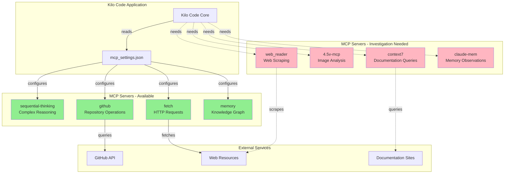
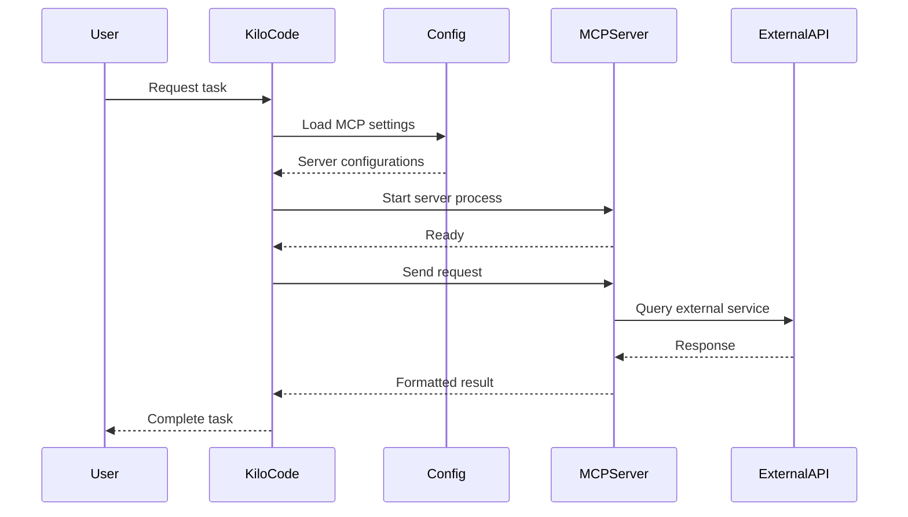
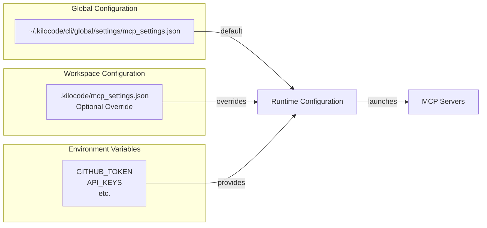
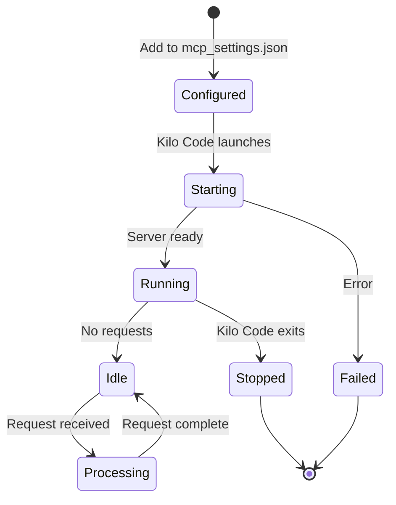
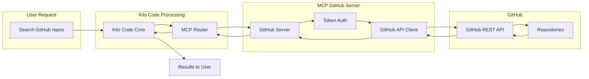
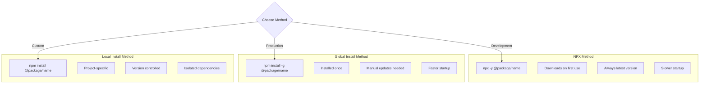
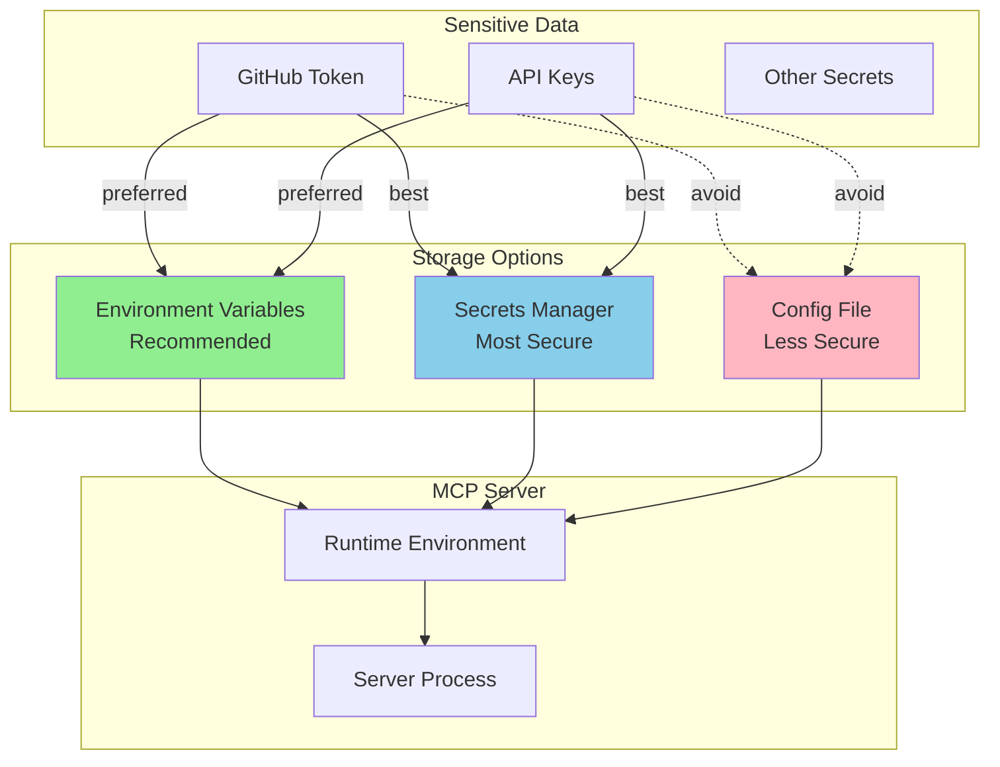
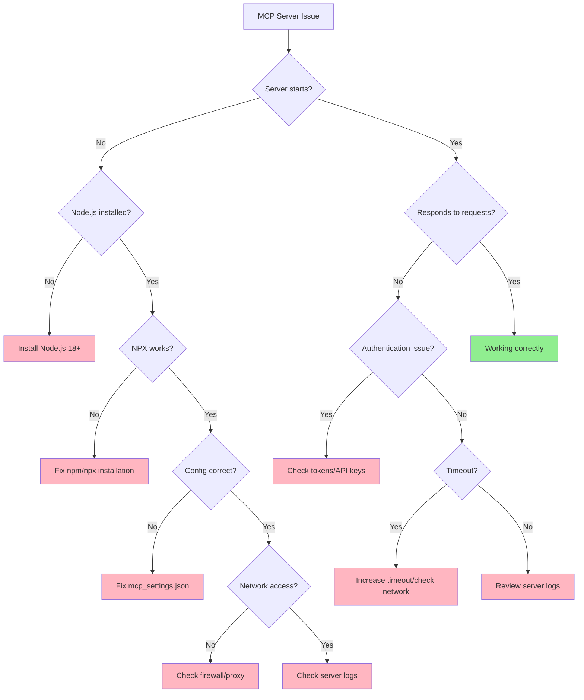
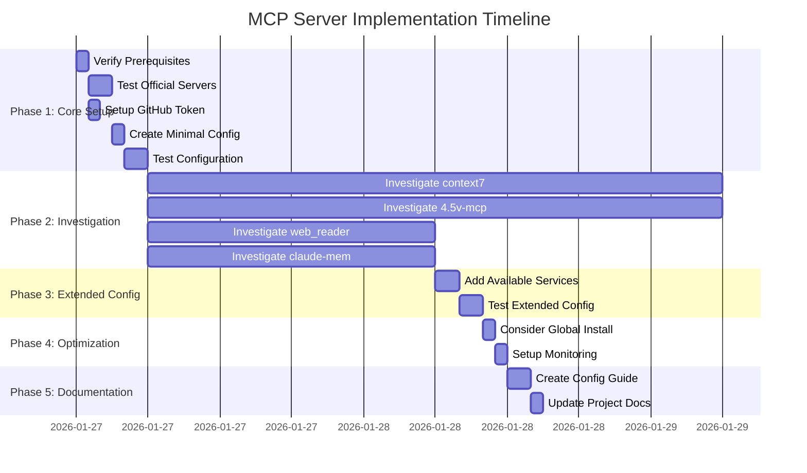
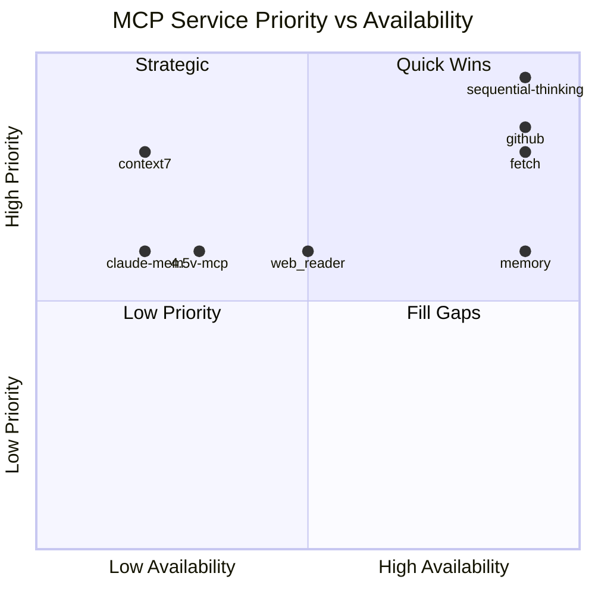

# MCP Architecture Overview

## System Architecture



**Legend:**
- 🟢 Green: Available and ready to configure
- 🔴 Pink: Needs investigation or custom implementation
- Solid lines: Confirmed connections
- Dotted lines: Potential connections

---

## MCP Communication Flow



---

## Configuration Hierarchy



---

## Server Lifecycle



---

## Data Flow: GitHub Operations Example



---

## Installation Options Comparison



---

## Security Model



---

## Troubleshooting Decision Tree



---

## Implementation Phases Timeline



---

## Service Priority Matrix



**Interpretation:**
- **Quadrant 1 (Quick Wins):** High priority, high availability - implement first
- **Quadrant 2 (Strategic):** High priority, low availability - needs investigation
- **Quadrant 3 (Low Priority):** Low priority, low availability - defer
- **Quadrant 4 (Fill Gaps):** Low priority, high availability - nice to have

---

## Configuration File Structure

```
~/.kilocode/
├── cli/
│   ├── config.json
│   ├── history.json
│   ├── logs/
│   │   └── cli.txt
│   └── global/
│       ├── global-state.json
│       ├── secrets.json
│       ├── cache/
│       │   └── [model caches]
│       ├── settings/
│       │   ├── custom_modes.yaml
│       │   └── mcp_settings.json  ← TARGET FILE
│       └── tasks/
│           └── [task data]
```

---

## Recommended Configuration (Phase 1)

This is the minimal working configuration to start with:

```json
{
  "mcpServers": {
    "sequential-thinking": {
      "command": "npx",
      "args": ["-y", "@modelcontextprotocol/server-sequential-thinking"],
      "description": "Complex reasoning and planning"
    },
    "github": {
      "command": "npx",
      "args": ["-y", "@modelcontextprotocol/server-github"],
      "env": {
        "GITHUB_PERSONAL_ACCESS_TOKEN": "${GITHUB_TOKEN}"
      },
      "description": "GitHub repository operations"
    },
    "fetch": {
      "command": "npx",
      "args": ["-y", "@modelcontextprotocol/server-fetch"],
      "description": "HTTP/HTTPS requests"
    },
    "memory": {
      "command": "npx",
      "args": ["-y", "@modelcontextprotocol/server-memory"],
      "description": "Knowledge graph and persistent memory"
    }
  }
}
```

**Note:** The `description` field is optional but helpful for documentation.

---

## Next Steps Summary

1. ✅ **Completed:** Analysis and planning
2. 🔄 **Ready:** Phase 1 implementation (4 official servers)
3. ⏳ **Pending:** Investigation of 4 missing services
4. ⏳ **Future:** Extended configuration and optimization

---

## Key Findings

### Available Now (4/8 services)
- ✅ sequential-thinking - CRITICAL for Phase 0
- ✅ github - High priority
- ✅ fetch - High priority  
- ✅ memory - Medium priority

### Needs Investigation (4/8 services)
- ❓ context7 - Documentation queries
- ❓ 4.5v-mcp - Image analysis (may be built-in)
- ❓ web_reader - Web scraping (puppeteer alternative exists)
- ❓ claude-mem - Memory observations (may be built-in)

### Critical Questions
1. Are the missing services internal to Kilo Code?
2. Should we proceed with partial implementation?
3. What are acceptable alternatives for missing services?
