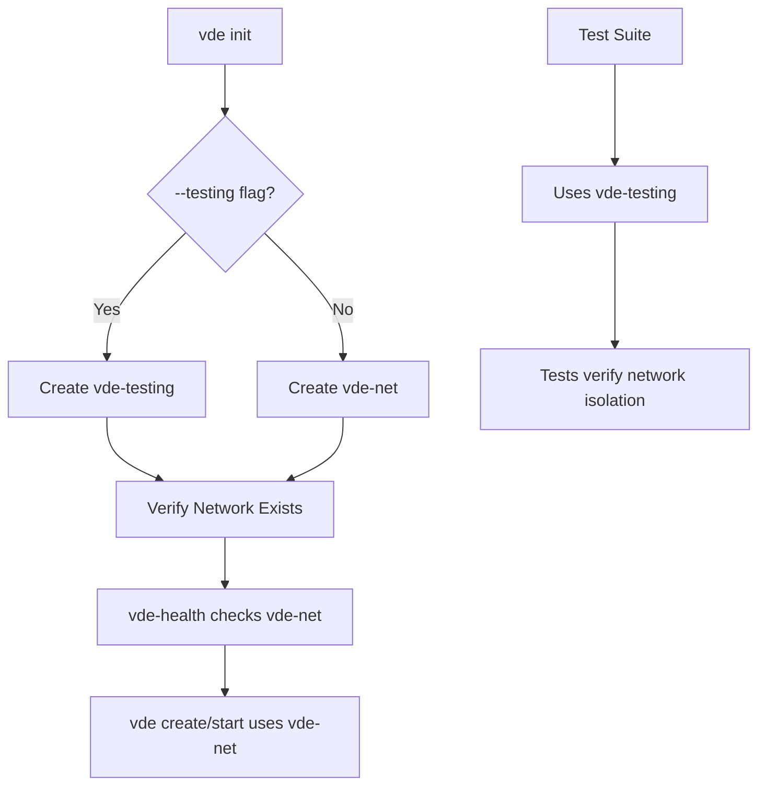

# VDE Network Management Implementation Plan

## Overview
Add `vde init` command to manage Docker network setup and ensure production VMs use `vde-net` while tests use `vde-testing`.

## Network Naming Convention
| Network Name | Purpose |
|--------------|---------|
| `vde-net` | Production VMs (language and service containers) |
| `vde-testing` | Test suite isolation |

---

## Implementation Steps

### Phase 1: Core Network Management

#### 1.1 Update vde-constants
- Change `VDE_DOCKER_NETWORK` from `vde-network` to `vde-net`
- Add `VDE_TEST_NETWORK="vde-testing"` constant

#### 1.2 Update vde-networks Script
- Rename `VDE_NETWORK` variable from `vde-net` to use constant
- Add support for `--testing` flag to manage test network
- Add `--ensure` flag for idempotent network creation

#### 1.3 Update build-and-start Script
- Change network creation from `vde-network` to `vde-net`
- Use idempotent creation pattern

#### 1.4 Add vde init Command
Add to [`scripts/vde`](scripts/vde:50) in command registry:
```zsh
"init:Initialize VDE:vde-init"
```

Create [`scripts/vde-init`](scripts/vde-init) with:
- Create vde-net network (idempotent)
- Verify Docker is running
- Support `--testing` flag to create vde-testing network
- Support `--force` flag to recreate networks
- Display network status after creation

---

### Phase 2: Template Updates

#### 2.1 Update compose-language.yml
File: [`scripts/templates/compose-language.yml`](scripts/templates/compose-language.yml:36)
```yaml
networks:
  - vde-net

networks:
  vde-net:
    external: true
```

#### 2.2 Update compose-service.yml
File: [`scripts/templates/compose-service.yml`](scripts/templates/compose-service.yml:38)
```yaml
networks:
  - vde-net

networks:
  vde-net:
    external: true
```

---

### Phase 3: Health Check Integration

#### 3.1 Update vde-health
Add network existence check:
- Verify `vde-net` exists on each health check
- Warn if network missing
- Include network info in status output

---

### Phase 4: Test Infrastructure

#### 4.1 Create Test Network Setup
Add network creation in test harness:
- Create `vde-testing` network before running tests
- Cleanup `vde-testing` network after test suite

#### 4.2 Update Behave Configuration
File: [`behave.ini`](behave.ini)
- Add environment variable for test network name

#### 4.3 Update Test Step Definitions
- Add steps to verify `vde-testing` network exists
- Add steps to verify VMs connect to correct network

---

## Mermaid Diagram: Network Flow



---

## Files to Modify

| File | Change |
|------|--------|
| `scripts/lib/vde-constants` | Add VDE_TEST_NETWORK, update VDE_DOCKER_NETWORK |
| `scripts/vde` | Add init command to registry |
| `scripts/vde-networks` | Use constants, add --testing support |
| `scripts/build-and-start` | Use vde-net instead of vde-network |
| `scripts/templates/compose-language.yml` | Change dev-net to vde-net |
| `scripts/templates/compose-service.yml` | Change dev-net to vde-net |
| `scripts/vde-health` | Add network existence check |
| `behave.ini` | Add test network config |
| `tests/` | Update step definitions for vde-testing |

---

## Files to Create

| File | Purpose |
|------|---------|
| `scripts/vde-init` | New init command implementation |

---

## Acceptance Criteria

1. ✅ `vde init` creates `vde-net` network on first run
2. ✅ `vde init --testing` creates `vde-testing` network
3. ✅ All production VMs connect to `vde-net`
4. ✅ Test suite uses `vde-testing` network
5. ✅ `vde health` verifies `vde-net` exists
6. ✅ `vde networks` lists both networks
7. ✅ Idempotent: running init multiple times is safe
