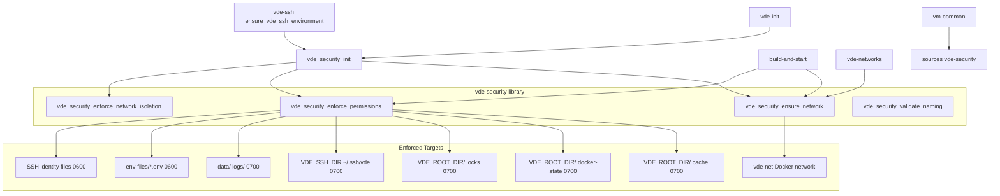

# Plan 36: Security Architecture Documentation & Test Coverage

**Date:** 2026-02-20  
**Status:** Pending Approval  
**Scope:** Documentation updates and unit test creation for the new security architecture

---

## Context

The following structural improvements have been implemented but are not yet reflected in the authoritative documentation:

1. **[`scripts/lib/vde-security`](../scripts/lib/vde-security)** — New system-wide security library
2. **Unified `vde-` naming convention** — All containers/images now use `vde-{name}` (e.g., `vde-python`, `vde-postgres`)
3. **SSH isolation** — All host-side SSH assets live in `${HOME}/.ssh/vde/`

The following documents are **out of date** and must be updated:
- [`docs/VDE-SPEC.md`](../docs/VDE-SPEC.md) — Authoritative specification (requires explicit user authorization per AGENTS.md)
- [`docs/ARCHITECTURE.md`](../docs/ARCHITECTURE.md)
- [`SECURITY.md`](../SECURITY.md)
- [`PROJECT_STATUS.md`](../PROJECT_STATUS.md)

Additionally, no unit tests exist for the new [`scripts/lib/vde-security`](../scripts/lib/vde-security) library.

---

## System Architecture Diagram



---

## Naming Convention Change Summary

| Aspect | Old Convention | New Convention |
|--------|---------------|----------------|
| Container name | `python-dev` | `vde-python` |
| SSH Host alias | `Host python-dev` | `Host vde-python` |
| Docker image | `python:latest` | `vde-python:latest` |
| Config directory | `configs/docker/python/` | `configs/docker/python/` (unchanged) |
| Workspace directory | `projects/python/` | `projects/python/` (unchanged) |
| Service container | `postgres` | `vde-postgres` |

---

## Detailed Change Plan

### 1. `docs/VDE-SPEC.md` Updates (Version bump: 1.0.1 → 1.1.0)

**Authorization required** per AGENTS.md mandate before implementation.

#### 1a. Update Section 3.1 (vde-constants)
Add the following constants that are now defined in [`scripts/lib/vde-constants`](../scripts/lib/vde-constants):
```zsh
# SSH Isolation
readonly VDE_SSH_DIR="${HOME}/.ssh/vde"
readonly VDE_SSH_CONFIG="${VDE_SSH_DIR}/config"
readonly VDE_SSH_KNOWN_HOSTS="${VDE_SSH_DIR}/known_hosts"
readonly VDE_SSH_IDENTITY="${VDE_SSH_DIR}/id_ed25519"

# Container Naming
readonly VDE_CONTAINER_PREFIX="vde-"
readonly VDE_DOCKER_NETWORK="vde-net"
```

#### 1b. Add Section 3.9 (vde-naming)
Document the interface for [`scripts/lib/vde-naming`](../scripts/lib/vde-naming):
```zsh
# vde_validate_name NAME
# Validate a VM name (allows with or without vde- prefix)
# Returns: VDE_SUCCESS or 1 with message to stdout

# vde_normalize_name NAME
# Strip vde- prefix, lowercase — returns raw canonical name for filesystem use
# Output: raw name (e.g., "python") to stdout

# vde_get_container_name VM_NAME
# Get Docker container name (ensures vde- prefix)
# Output: "vde-{name}" to stdout

# vde_get_ssh_host VM_NAME
# Get SSH Host alias (same as container name)
# Output: "vde-{name}" to stdout

# vde_get_hostname VM_NAME
# Get internal container hostname (same as container name)
# Output: "vde-{name}" to stdout

# vde_detect_vm_type_from_name NAME
# Detect VM type from name using VM_TYPE map or fallback patterns
# Output: "lang" | "service" to stdout
```

#### 1c. Add Section 3.10 (vde-security)
Document the interface for [`scripts/lib/vde-security`](../scripts/lib/vde-security):
```zsh
# vde_security_enforce_permissions
# Enforce strict permissions on all sensitive VDE directories and files:
#   - 0700: .cache, .docker-state, .locks, data/, logs/, VDE_SSH_DIR, env-files/
#   - 0600: SSH identity files, SSH config, SSH known_hosts, *.env files
#   - 0755: scripts/ and all script files
# Returns: VDE_SUCCESS

# vde_security_ensure_network NETWORK_NAME
# Ensure the isolated VDE Docker network exists
# Args: NETWORK_NAME (default: VDE_DOCKER_NETWORK)
# Returns: VDE_SUCCESS

# vde_security_validate_naming
# Audit running containers for vde- naming convention compliance
# Returns: VDE_SUCCESS

# vde_security_enforce_network_isolation NETWORK_NAME
# Ensure all vde-* containers are connected to the VDE network
# Args: NETWORK_NAME (default: VDE_DOCKER_NETWORK)
# Returns: VDE_SUCCESS

# vde_security_init
# Initialize full security environment: network + permissions + isolation
# Called by: vde-init, ensure_vde_ssh_environment, build-and-start
# Returns: VDE_SUCCESS
```

#### 1d. Update Section 5.1 (Language VM Template)
Change `container_name: {{NAME}}-dev` → `container_name: vde-{{NAME}}`  
Change service key `{{NAME}}-dev:` → `vde-{{NAME}}:`

#### 1e. Update Section 5.3 (SSH Config Entry Template)
Change `Host {{VM_NAME}}-dev` → `Host vde-{{VM_NAME}}`

#### 1f. Update Section 9 (File System Layout)
Add `vde-security` and `vde-naming` to the `scripts/lib/` listing.

#### 1g. Add Section 14 (Security Architecture)
New section documenting:
- Permission enforcement policy
- Network isolation strategy
- SSH isolation in `~/.ssh/vde/`
- Startup integration points

#### 1h. Increment version and timestamp
`Version: 1.0.1` → `Version: 1.1.0`  
`Last Updated: 2026-02-15T05:33:16Z` → `Last Updated: 2026-02-20T06:00:00Z`

---

### 2. `docs/ARCHITECTURE.md` Updates

#### 2a. Add vde-security to Core Libraries table
```
| vde-security | Security policy enforcement (permissions, network isolation, SSH isolation) | vde-constants, vde-log |
```

#### 2b. Add vde-naming to Additional Libraries table
Move `vde-naming` from Additional to Core Libraries (it is now a required dependency of `vm-common`).

#### 2c. Update Library Loading Order
```zsh
source "$SCRIPTS_DIR/lib/vde-constants"      # 1. Base constants
source "$SCRIPTS_DIR/lib/vde-shell-compat"   # 2. Shell compatibility
source "$SCRIPTS_DIR/lib/vde-errors"         # 3. Error handling
source "$SCRIPTS_DIR/lib/vde-log"            # 4. Logging
source "$SCRIPTS_DIR/lib/vde-naming"         # 5. Naming conventions
source "$SCRIPTS_DIR/lib/vde-security"       # 6. Security enforcement
source "$SCRIPTS_DIR/lib/vde-core"           # 7. Core VDE functions
source "$SCRIPTS_DIR/lib/vm-common"          # 8. Full VDE functionality
source "$SCRIPTS_DIR/lib/vde-commands"       # 9. Command wrappers
source "$SCRIPTS_DIR/lib/vde-parser"         # 10. Natural language parser
```

#### 2d. Update VM Container Name column (Language VMs table)
All entries change from `{name}-dev` → `vde-{name}`:
- `c-dev` → `vde-c`
- `python-dev` → `vde-python`
- `rust-dev` → `vde-rust`
- etc.

#### 2e. Update Service VM Container Name column
All entries change from bare name → `vde-{name}`:
- `postgres` → `vde-postgres`
- `redis` → `vde-redis`
- etc.

#### 2f. Update Port Allocation examples
Change `c-dev 2200` → `vde-c 2200`, etc.

---

### 3. `SECURITY.md` Updates

#### 3a. Add "Automated Security Enforcement" section
New section under "Security Features":
```markdown
### Automated Security Enforcement (vde-security library)

VDE includes a dedicated security library (`scripts/lib/vde-security`) that
automatically enforces security policies at startup:

**Directory Permissions:**
- `0700` on: `.cache/`, `.docker-state/`, `.locks/`, `data/`, `logs/`, `~/.ssh/vde/`, `env-files/`
- `0600` on: SSH identity files, SSH config, SSH known_hosts, `*.env` files
- `0755` on: `scripts/` and all script files

**Network Isolation:**
- All VDE containers run on a dedicated `vde-net` Docker bridge network
- Containers that drift from the network are automatically re-attached
- Network is labeled `vde.managed=true` for identification

**SSH Isolation:**
- All VDE SSH assets are isolated in `~/.ssh/vde/` (separate from user's `~/.ssh/`)
- VDE SSH config only contains VDE VM entries
- VDE known_hosts only contains VDE container host keys
```

#### 3b. Update "Security Features" bullet list
Update the "Shared network" bullet:
- Old: `Shared network: Controlled inter-container communication`
- New: `Isolated network: All containers on dedicated vde-net bridge network with automatic drift correction`

---

### 4. `PROJECT_STATUS.md` Updates

#### 4a. Update Last Updated date
`Thursday, February 12, 2026` → `Thursday, February 20, 2026`

#### 4b. Update SSH Configuration reliability
Improve from 🟡 Medium / 70% to reflect the new isolation improvements.

#### 4c. Add security improvements note
Add a brief note in the Executive Summary or a new "Recent Improvements" section.

---

### 5. Create `tests/unit/vde-security.test.zsh`

New unit test file following the pattern of [`tests/unit/vde-naming.test.zsh`](../tests/unit/vde-naming.test.zsh).

**Test cases to implement:**

| Test | Description | Docker Required? |
|------|-------------|-----------------|
| `test_library_loads` | vde-security sources without error | No |
| `test_functions_exist` | All 5 public functions are defined | No |
| `test_enforce_permissions_creates_dirs` | Creates missing sensitive dirs with 0700 | No |
| `test_enforce_permissions_ssh_dir` | Sets 0700 on VDE_SSH_DIR if it exists | No |
| `test_enforce_permissions_identity_file` | Sets 0600 on SSH identity file if it exists | No |
| `test_enforce_permissions_env_files` | Sets 0600 on *.env files if they exist | No |
| `test_ensure_network_skips_if_no_docker` | Gracefully handles missing Docker | No |
| `test_validate_naming_returns_success` | Returns VDE_SUCCESS even with no containers | No |
| `test_enforce_network_isolation_no_docker` | Gracefully handles missing Docker | No |
| `test_security_init_calls_all_three` | vde_security_init invokes all sub-functions | No |

**Note:** Docker-dependent tests (actual network creation, container inspection) belong in BDD feature files, not unit tests.

---

## Implementation Order

The tasks should be executed in this sequence to maintain consistency:

```
1. VDE-SPEC.md (spec first — code/tests must conform to spec)
2. ARCHITECTURE.md (reflects spec changes)
3. SECURITY.md (reflects new security features)
4. PROJECT_STATUS.md (reflects current state)
5. tests/unit/vde-security.test.zsh (proves implementation)
```

---

## Files to Modify

| File | Type | Change Summary |
|------|------|----------------|
| [`docs/VDE-SPEC.md`](../docs/VDE-SPEC.md) | Spec | Add vde-security/vde-naming sections, update templates, version bump |
| [`docs/ARCHITECTURE.md`](../docs/ARCHITECTURE.md) | Docs | Add vde-security, update naming tables, update load order |
| [`SECURITY.md`](../SECURITY.md) | Docs | Add automated enforcement section, update features list |
| [`PROJECT_STATUS.md`](../PROJECT_STATUS.md) | Docs | Update date, SSH status, add security note |
| [`tests/unit/vde-security.test.zsh`](../tests/unit/vde-security.test.zsh) | Tests | New file — 10 unit tests |
