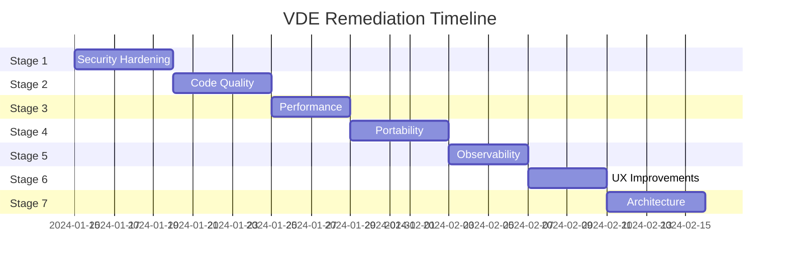
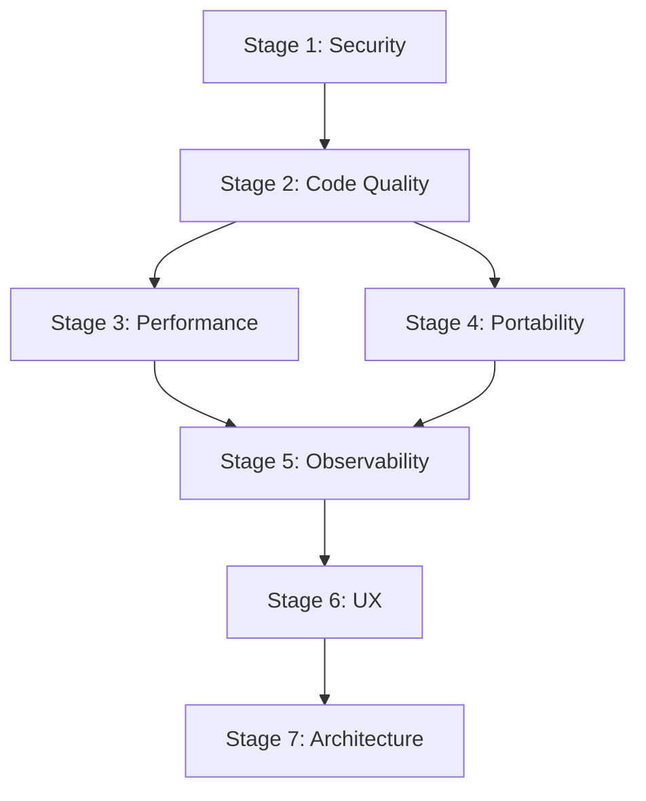

# VDE Remediation Plan - Multistage Implementation

## Executive Summary

This document outlines a comprehensive 7-stage remediation plan to address all identified issues in the VDE (Virtual Development Environment) system. The plan is organized by priority, with security issues addressed first, followed by code quality, performance, compatibility, observability, UX, and finally architectural improvements.

**Total Estimated Scope:** 7 stages, 47 individual tasks
**Dependencies:** Each stage builds on the previous, though some tasks within stages can be parallelized

---

## Stage 1: Security Hardening (Critical Priority)

### Objective
Eliminate all security vulnerabilities that could lead to code injection, privilege escalation, or data exposure.

### Tasks

#### 1.1 Fix Eval Injection Vulnerability
- **File:** `scripts/lib/vde-parser`
- **Line:** 269
- **Current Code:** `eval "$value"`
- **Issue:** Arbitrary code execution via crafted plan FLAGS
- **Solution:** Replace `eval` with explicit variable parsing using pattern matching
- **Implementation:**
  - Create a `parse_flags()` function that validates each flag against a whitelist
  - Only accept known flags: `rebuild`, `nocache`
  - Reject any input containing shell metacharacters: `; | & $ \` ( ) { } < >`

#### 1.2 Fix SSH Key Permissions
- **File:** `scripts/lib/vm-common`
- **Line:** 504
- **Current Code:** `chmod 644 "$dest_path"`
- **Issue:** Public keys readable by all users
- **Solution:** Use `chmod 600` for private keys, `chmod 644` only for `.pub` files
- **Implementation:**
  - Add file type detection before setting permissions
  - Validate that only public keys are copied to `public-ssh-keys/`
  - Add warning if private key is accidentally placed in public directory

#### 1.3 Add Input Sanitization to Plan Parser
- **File:** `scripts/lib/vde-parser`
- **Lines:** 252-275
- **Issue:** No validation of plan content before processing
- **Solution:** Implement strict input validation
- **Implementation:**
  - Create `validate_plan_line()` function
  - Whitelist allowed keys: `INTENT`, `VM`, `FLAGS`, `FILTER`
  - Validate VM names against known VM list
  - Reject lines with unexpected characters

#### 1.4 Fix Port Allocation Race Condition
- **File:** `scripts/lib/vm-common`
- **Lines:** 227-258
- **Issue:** TOCTOU (Time-of-Check-Time-of-Use) vulnerability
- **Solution:** Implement atomic port reservation using lock files
- **Implementation:**
  - Create `$VDE_ROOT_DIR/.locks/` directory
  - Use `flock` or equivalent for atomic port reservation
  - Add cleanup mechanism for stale locks
  - Implement retry logic with exponential backoff

#### 1.5 Fix SSH Config Race Condition
- **File:** `scripts/lib/vm-common`
- **Lines:** 625-660
- **Issue:** Check-then-write pattern allows race conditions
- **Solution:** Use atomic file operations
- **Implementation:**
  - Write to temporary file first
  - Use `mv` for atomic replacement
  - Implement file locking during modification
  - Add rollback capability on failure

### Success Criteria
- [ ] No `eval` calls on untrusted input
- [ ] All file permissions follow principle of least privilege
- [ ] All input validated before processing
- [ ] Race conditions eliminated via atomic operations
- [ ] Security test suite passes (to be created in Stage 2)

---

## Stage 2: Code Quality Improvements (High Priority)

### Objective
Improve code maintainability, reduce duplication, and establish consistent patterns.

### Tasks

#### 2.1 Remove Duplicate Code
- **Files:** `scripts/lib/vm-common`
- **Issue:** `get_vm_ssh_port()` defined twice (lines 180 and 813)
- **Solution:** Remove duplicate, keep single authoritative implementation
- **Implementation:**
  - Audit all functions for duplicates
  - Create function registry documentation
  - Add shellcheck directive to prevent future duplicates

#### 2.2 Standardize Return Codes
- **Files:** All library files
- **Issue:** Inconsistent return values across functions
- **Solution:** Establish return code convention
- **Implementation:**
  - Define standard return codes:
    - `0`: Success
    - `1`: General error
    - `2`: Invalid input
    - `3`: Resource not found
    - `4`: Permission denied
    - `5`: Timeout
  - Document return codes for each function
  - Update all functions to follow convention

#### 2.3 Replace Magic Numbers with Constants
- **File:** `scripts/lib/vm-common`
- **Lines:** 26-29
- **Issue:** Port ranges hardcoded without explanation
- **Solution:** Create named constants with documentation
- **Implementation:**
  - Create `scripts/lib/vde-constants` file
  - Define all magic numbers as named constants
  - Add inline documentation explaining each value
  - Source constants file in all scripts

#### 2.4 Add Error Handling to Docker Operations
- **File:** `scripts/lib/vm-common`
- **Line:** 300
- **Issue:** No error checking on docker-compose result
- **Solution:** Implement comprehensive error handling
- **Implementation:**
  - Capture docker-compose exit code
  - Parse stderr for common error patterns
  - Implement retry logic for transient failures
  - Log all failures with context

#### 2.5 Create Comprehensive Test Suite
- **Directory:** `tests/`
- **Issue:** Existing tests may not cover security fixes
- **Solution:** Expand test coverage
- **Implementation:**
  - Add unit tests for all security-critical functions
  - Add integration tests for race condition scenarios
  - Add fuzzing tests for input validation
  - Target 80% code coverage minimum

### Success Criteria
- [ ] No duplicate function definitions
- [ ] All functions return documented exit codes
- [ ] No magic numbers in code
- [ ] All docker operations have error handling
- [ ] Test coverage >= 80%

---

## Stage 3: Performance Optimization (Medium Priority)

### Objective
Reduce latency, minimize I/O operations, and improve scalability.

### Tasks

#### 3.1 Implement VM Type Caching
- **File:** `scripts/lib/vm-common`
- **Issue:** VM types re-parsed on every script invocation
- **Solution:** Implement persistent cache
- **Implementation:**
  - Create cache file at `$VDE_ROOT_DIR/.cache/vm-types.cache`
  - Store parsed associative arrays in serialized format
  - Invalidate cache when `vm-types.conf` changes (mtime check)
  - Add `--no-cache` flag to force reload

#### 3.2 Optimize Port Allocation
- **File:** `scripts/lib/vm-common`
- **Lines:** 202-225
- **Issue:** Scans all docker-compose files on every call
- **Solution:** Maintain port allocation registry
- **Implementation:**
  - Create `$VDE_ROOT_DIR/.cache/port-registry.json`
  - Update registry on VM create/delete
  - Read from registry instead of scanning files
  - Add consistency check on startup

#### 3.3 Optimize VM Name Extraction
- **File:** `scripts/lib/vde-parser`
- **Lines:** 114-133
- **Issue:** O(n×m) nested loops for VM lookup
- **Solution:** Use hash-based lookup
- **Implementation:**
  - Pre-build alias-to-name mapping on startup
  - Store in associative array for O(1) lookup
  - Update mapping when VM types change

#### 3.4 Add Lazy Loading
- **Files:** All library files
- **Issue:** All functions loaded even when not needed
- **Solution:** Implement lazy loading pattern
- **Implementation:**
  - Split libraries into core and optional modules
  - Load optional modules on first use
  - Add `autoload` mechanism for zsh functions

### Success Criteria
- [ ] VM type lookup < 1ms (cached)
- [ ] Port allocation < 5ms
- [ ] VM name extraction < 2ms
- [ ] Cold start time < 100ms

---

## Stage 4: Portability and Compatibility (Medium Priority)

### Objective
Enable VDE to run on bash and other POSIX shells, not just zsh.

### Tasks

#### 4.1 Create Shell Abstraction Layer
- **New File:** `scripts/lib/vde-shell-compat`
- **Issue:** Zsh-specific syntax throughout codebase
- **Solution:** Create compatibility layer
- **Implementation:**
  - Detect current shell at runtime
  - Provide fallback implementations for zsh-specific features
  - Abstract associative arrays using external storage for bash
  - Document minimum shell requirements

#### 4.2 Replace Zsh-Specific Syntax
- **Files:** All scripts
- **Issue:** `${(%):-%x}`, `typeset -gA`, etc.
- **Solution:** Use POSIX-compatible alternatives
- **Implementation:**
  - Replace `${(%):-%x}` with `$0` or `${BASH_SOURCE[0]}`
  - Replace `typeset -gA` with file-based key-value store
  - Replace zsh array syntax with POSIX arrays
  - Add shell detection and warning for unsupported shells

#### 4.3 Add Bash Compatibility Tests
- **Directory:** `tests/compatibility/`
- **Issue:** No testing on non-zsh shells
- **Solution:** Add cross-shell test suite
- **Implementation:**
  - Create test runner that executes tests in multiple shells
  - Test on: zsh 5.0+, bash 4.0+, bash 5.0+
  - Document known incompatibilities
  - Add CI jobs for each supported shell

#### 4.4 Update Documentation
- **Files:** `docs/requirements.md`, `README.md`
- **Issue:** Shell requirements not clearly documented
- **Solution:** Add comprehensive compatibility documentation
- **Implementation:**
  - List supported shells and versions
  - Document feature availability per shell
  - Add troubleshooting for shell-specific issues

### Success Criteria
- [ ] All core functions work in bash 4.0+
- [ ] Compatibility tests pass on zsh 5.0+, bash 4.0+, bash 5.0+
- [ ] Clear documentation of shell requirements
- [ ] Graceful degradation for unsupported features

---

## Stage 5: Observability and Monitoring (Medium Priority)

### Objective
Add comprehensive logging, metrics, and monitoring capabilities.

### Tasks

#### 5.1 Implement Structured Logging
- **New File:** `scripts/lib/vde-logging`
- **Issue:** Human-readable logs only, no machine parsing
- **Solution:** Add JSON structured logging
- **Implementation:**
  - Create logging library with multiple output formats
  - Support: plain text, JSON, syslog
  - Include: timestamp, level, component, message, context
  - Add log level filtering (DEBUG, INFO, WARN, ERROR)

#### 5.2 Add Log Rotation
- **File:** `scripts/lib/vde-logging`
- **Issue:** Logs grow indefinitely
- **Solution:** Implement log rotation
- **Implementation:**
  - Rotate logs daily or at 10MB
  - Keep 7 days of history
  - Compress rotated logs
  - Add cleanup for old logs

#### 5.3 Add Audit Logging
- **New File:** `scripts/lib/vde-audit`
- **Issue:** No record of who ran what command
- **Solution:** Implement audit trail
- **Implementation:**
  - Log all state-changing operations
  - Include: user, timestamp, command, arguments, result
  - Store in separate audit log file
  - Add audit log viewer command

#### 5.4 Add Health Checks
- **New File:** `scripts/vde-health`
- **Issue:** No way to check system health
- **Solution:** Create health check command
- **Implementation:**
  - Check Docker daemon status
  - Check container health
  - Check port availability
  - Check SSH connectivity
  - Return structured health report

#### 5.5 Add Metrics Collection
- **New File:** `scripts/lib/vde-metrics`
- **Issue:** No performance metrics
- **Solution:** Implement metrics collection
- **Implementation:**
  - Track: command latency, container start time, error rates
  - Store metrics in local file
  - Add metrics export command
  - Optional: Prometheus endpoint

### Success Criteria
- [ ] All operations logged in structured format
- [ ] Log rotation working automatically
- [ ] Audit trail for all state changes
- [ ] Health check command available
- [ ] Basic metrics collection working

---

## Stage 6: UX Improvements (Low Priority)

### Objective
Improve user experience with better feedback, error messages, and discoverability.

### Tasks

#### 6.1 Add Progress Indicators
- **Files:** All user-facing scripts
- **Issue:** No feedback during long operations
- **Solution:** Add progress bars and spinners
- **Implementation:**
  - Create `scripts/lib/vde-progress` library
  - Add spinner for indeterminate operations
  - Add progress bar for determinate operations
  - Show elapsed time for long operations

#### 6.2 Improve Error Messages
- **Files:** All scripts
- **Issue:** Cryptic error messages
- **Solution:** Add contextual error messages
- **Implementation:**
  - Create error message catalog
  - Include: what went wrong, why, how to fix
  - Add suggestions for common errors
  - Include relevant documentation links

#### 6.3 Add Shell Completion
- **New Files:** `scripts/completions/`
- **Issue:** No auto-completion support
- **Solution:** Add completion scripts
- **Implementation:**
  - Create zsh completion script
  - Create bash completion script
  - Complete: VM names, commands, flags
  - Add installation instructions

#### 6.4 Standardize Naming Conventions
- **Files:** Templates, documentation
- **Issue:** Inconsistent naming (python-dev vs postgres)
- **Solution:** Establish and enforce naming convention
- **Implementation:**
  - Document naming convention
  - Add `-dev` suffix to all language VMs
  - Keep service VMs without suffix
  - Update all templates and documentation

#### 6.5 Add Interactive Mode Improvements
- **File:** `scripts/vde-chat`
- **Issue:** Limited interactive features
- **Solution:** Enhance chat mode
- **Implementation:**
  - Add command history persistence
  - Add tab completion in chat
  - Add multi-line input support
  - Add command aliases

### Success Criteria
- [ ] Progress indicators for all long operations
- [ ] Error messages include remediation steps
- [ ] Shell completion working for zsh and bash
- [ ] Consistent naming across all VMs
- [ ] Enhanced interactive mode

---

## Stage 7: Architectural Enhancements (Low Priority)

### Objective
Improve system architecture for scalability, reliability, and maintainability.

### Tasks

#### 7.1 Add Container Health Checks
- **Files:** Docker Compose templates
- **Issue:** No health checks defined
- **Solution:** Add health checks to all containers
- **Implementation:**
  - Add healthcheck directive to docker-compose templates
  - Define health check commands per VM type
  - Configure check interval and timeout
  - Add health status to `vde-health` command

#### 7.2 Add Resource Limits
- **Files:** Docker Compose templates
- **Issue:** No CPU/memory limits
- **Solution:** Add configurable resource limits
- **Implementation:**
  - Add default resource limits to templates
  - Make limits configurable via env files
  - Add `--unlimited` flag for development
  - Document resource requirements

#### 7.3 Add Volume Backup Mechanism
- **New File:** `scripts/vde-backup`
- **Issue:** No backup for persistent data
- **Solution:** Create backup command
- **Implementation:**
  - Backup all data volumes
  - Support incremental backups
  - Add restore command
  - Add backup scheduling

#### 7.4 Add Configuration Versioning
- **Files:** All config files
- **Issue:** No schema version tracking
- **Solution:** Add version headers and migration
- **Implementation:**
  - Add version field to vm-types.conf
  - Create migration scripts for version upgrades
  - Add compatibility check on startup
  - Document upgrade procedures

#### 7.5 Expand Port Range
- **File:** `scripts/lib/vm-common`
- **Issue:** Limited to 100 ports per category
- **Solution:** Expand and make configurable
- **Implementation:**
  - Increase default range to 500 ports
  - Make ranges configurable via environment
  - Add port range validation
  - Document port allocation strategy

#### 7.6 Add IPv6 Support
- **Files:** Docker Compose templates, SSH config
- **Issue:** IPv4 only
- **Solution:** Add dual-stack support
- **Implementation:**
  - Update templates to bind to both IPv4 and IPv6
  - Update SSH config generation for IPv6
  - Add IPv6 to health checks
  - Document IPv6 configuration

### Success Criteria
- [ ] All containers have health checks
- [ ] Resource limits configurable
- [ ] Backup/restore working
- [ ] Configuration versioning in place
- [ ] Expanded port range
- [ ] IPv6 support available

---

## Implementation Timeline

---

## Risk Assessment

| Stage | Risk Level | Mitigation |
|-------|------------|------------|
| 1 - Security | High | Thorough testing, staged rollout |
| 2 - Code Quality | Medium | Comprehensive test suite |
| 3 - Performance | Low | Benchmark before/after |
| 4 - Portability | Medium | Cross-shell testing |
| 5 - Observability | Low | Feature flags for new logging |
| 6 - UX | Low | User feedback collection |
| 7 - Architecture | Medium | Backward compatibility testing |

---

## Dependencies Between Stages

---

## Testing Requirements

### Per-Stage Testing

| Stage | Unit Tests | Integration Tests | Manual Testing |
|-------|------------|-------------------|----------------|
| 1 | Security functions | Injection attempts | Penetration test |
| 2 | All refactored code | Full workflow | Code review |
| 3 | Cache operations | Performance benchmarks | Load testing |
| 4 | Shell compat layer | Cross-shell execution | Multi-platform |
| 5 | Logging functions | Log rotation | Log analysis |
| 6 | UI components | User workflows | Usability testing |
| 7 | Health checks | Backup/restore | Disaster recovery |

### Acceptance Criteria

Each stage must meet the following before proceeding:
1. All unit tests pass
2. All integration tests pass
3. No regression in existing functionality
4. Documentation updated
5. Code review approved

---

## Rollback Plan

Each stage should be independently rollbackable:

1. **Git Tags:** Create tag before each stage
2. **Feature Flags:** Use flags for new functionality
3. **Backward Compatibility:** Maintain old interfaces during transition
4. **Data Migration:** Ensure reversible data changes

---

## Next Steps

1. Review and approve this plan
2. Create GitHub issues for each task
3. Assign priorities and owners
4. Begin Stage 1 implementation
5. Schedule regular progress reviews
